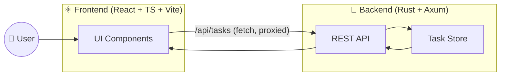
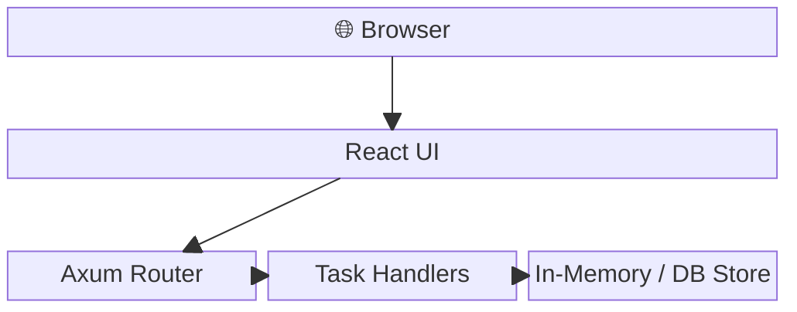
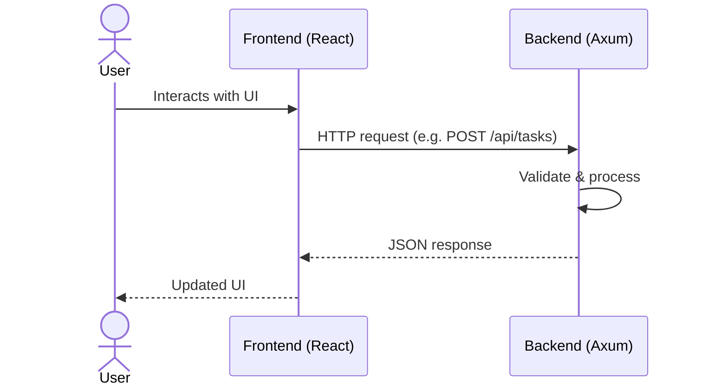
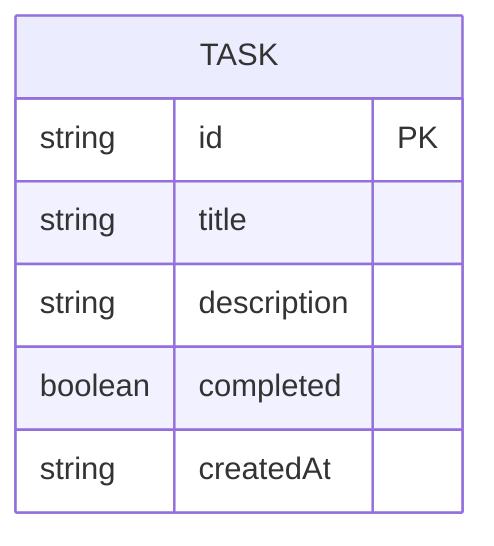
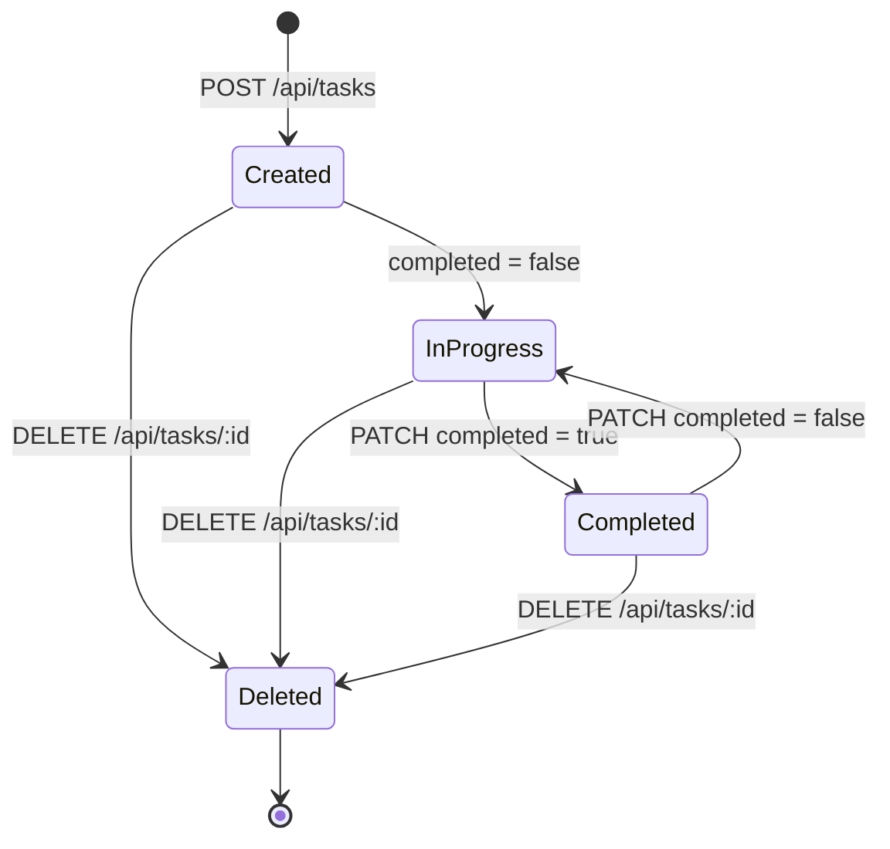
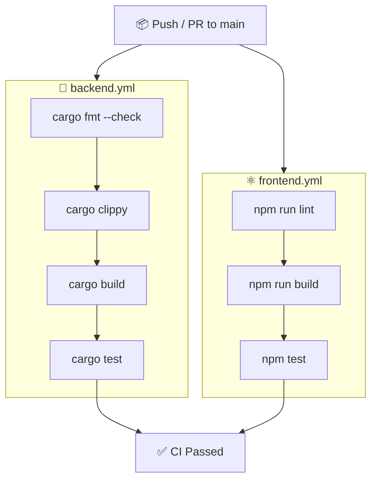
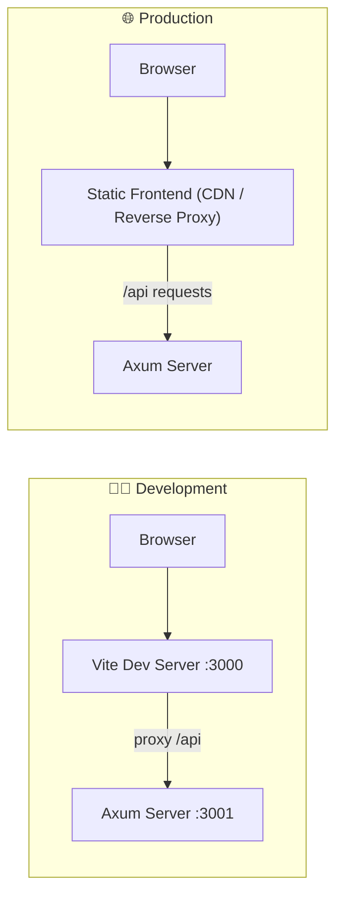

# 📋 Task Manager

A full-stack application with a React (TypeScript) frontend and a Rust (Axum) backend.

## 🗂️ Project Structure

```
.
├── backend/    # Rust + Axum REST API
├── frontend/   # React + TypeScript + Vite UI
└── .github/
    └── workflows/
        ├── backend.yml   # CI: fmt, clippy, build & test the backend
        └── frontend.yml  # CI: lint, build & test the frontend
```

## 🏗️ Architecture



## 🧱 Block Diagram



## 🔄 Request Flow



## 🗃️ Task Entity



## 🔁 Task State Diagram



## 🚀 Getting Started

### 🦀 Backend

```bash
cd backend
cargo run           # Start dev server on http://localhost:3001
cargo build --release  # Production build
cargo test          # Run tests
cargo clippy        # Lint
cargo fmt           # Format
```

### ⚛️ Frontend

```bash
cd frontend
npm install
npm run dev        # Start Vite dev server on http://localhost:3000
npm run build      # Production build → dist/
npm test           # Run Vitest tests
npm run lint       # ESLint
```

> The frontend dev server proxies `/api` requests to the backend at `http://localhost:3001`.

## 🔌 API Endpoints

| Method | Path              | Description        |
|--------|-------------------|--------------------|
| GET    | `/health`         | Health check       |
| GET    | `/api/tasks`      | List all tasks     |
| POST   | `/api/tasks`      | Create a task      |
| GET    | `/api/tasks/:id`  | Get a single task  |
| PATCH  | `/api/tasks/:id`  | Update a task      |
| DELETE | `/api/tasks/:id`  | Delete a task      |

## ⚙️ CI / GitHub Actions

Two workflows run on pushes and pull requests to `main`:

- ✅ **Backend CI** (`.github/workflows/backend.yml`) — fmt → clippy → build → test
- ✅ **Frontend CI** (`.github/workflows/frontend.yml`) — lint → build → test



## 🚢 Deployment Topology


