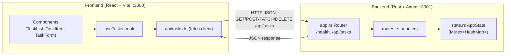
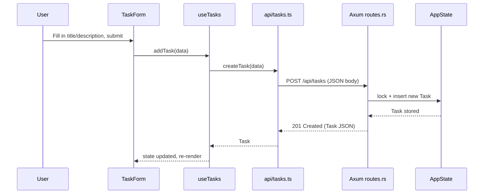

# Architecture

This document describes the high-level architecture of the Task Manager application: a
single-page React frontend backed by a Rust/Axum REST API.

## Overview

```
┌─────────────────────┐        HTTP (JSON)        ┌──────────────────────┐
│   Frontend (SPA)     │ ─────────────────────────▶│   Backend (REST API)  │
│ React + TypeScript   │◀───────────────────────── │   Rust + Axum         │
│ Vite dev server :3000│      /api/tasks/*          │   :3001               │
└─────────────────────┘        /health              └──────────────────────┘
                                                              │
                                                              ▼
                                                     In-memory task store
                                                     (HashMap behind a Mutex)
```

- The **frontend** is a React SPA built with Vite. In development it proxies
  requests under `/api` to the backend (see `frontend/vite.config.ts`), so the
  browser only ever talks to one origin.
- The **backend** is a stateless Axum HTTP server that exposes a small REST
  API for managing tasks. State is kept in memory for the lifetime of the
  process — there is no database.
- The two halves communicate exclusively over HTTP using JSON request/response
  bodies; there is no shared code or RPC layer between them.



## Backend (`backend/`)

Built with [Axum](https://github.com/tokio-rs/axum) on top of Tokio. Source is
organized as a library (`lib.rs`) plus a thin binary entry point (`main.rs`):

| Module | Responsibility |
|--------|-----------------|
| `main.rs` | Reads the `PORT` env var (default `3001`), builds the app/state, binds a TCP listener and serves it. |
| `app.rs` | Assembles the top-level `Router`: mounts `/health` and nests the task routes under `/api/tasks`. Applies a permissive CORS layer. |
| `routes.rs` | Handlers for listing, creating, reading, updating and deleting tasks. Talks to `AppState` directly (no separate service/repository layer). |
| `models.rs` | `Task` (the serialized API resource) plus `CreateTaskDto`/`UpdateTaskDto` request bodies. |
| `state.rs` | `AppState`, a cloneable handle wrapping `Arc<Mutex<HashMap<String, Task>>>` — the in-memory task store shared across requests. |
| `error.rs` | `AppError`, a uniform error type carrying an HTTP status code and message, rendered as `{ "error": { "message", "statusCode" } }` and implementing Axum's `IntoResponse`. |

Request flow: an incoming request is routed by `app::build_app` to a handler
in `routes.rs`, which locks the shared `AppState`, mutates/reads the
`HashMap<String, Task>`, and returns a `Json<T>` (or an `AppError` on
failure, mapped by Axum's error handling into an HTTP error response).

Because storage is a plain in-memory map, **all task data is lost when the
process restarts**, and the server is not horizontally scalable across
multiple instances (no shared/external store).

### API surface

| Method | Path              | Description        |
|--------|-------------------|---------------------|
| GET    | `/health`         | Health check        |
| GET    | `/api/tasks`      | List all tasks       |
| POST   | `/api/tasks`      | Create a task         |
| GET    | `/api/tasks/:id`  | Get a single task    |
| PATCH  | `/api/tasks/:id`  | Update a task         |
| DELETE | `/api/tasks/:id`  | Delete a task         |

## Frontend (`frontend/`)

A React 18 + TypeScript SPA bundled with Vite.

| Path | Responsibility |
|------|-----------------|
| `src/main.tsx` | Vite/React entry point, mounts `<App />`. |
| `src/App.tsx` | Top-level layout/shell; renders the `TaskList`. |
| `src/api/tasks.ts` | Thin `fetch`-based client for the backend's `/api/tasks` endpoints; defines the `Task`/`CreateTaskDto` types shared across the UI. |
| `src/hooks/useTasks.ts` | Encapsulates task state and data-fetching logic (load, add, toggle, remove) using the `api/tasks` client; the single source of truth for task state in the UI. |
| `src/components/TaskList.tsx` | Uses `useTasks` to render the list of tasks and the creation form. |
| `src/components/TaskItem.tsx` | Renders a single task row (toggle complete / delete). |
| `src/components/TaskForm.tsx` | Form for creating a new task. |

State management is intentionally simple: `useTasks` is the only stateful
hook, and components below `TaskList` are largely presentational, receiving
data and callbacks as props. There is no global state library — component
state plus this one custom hook is sufficient for the app's scope.

In development, Vite serves the app on port `3000` and proxies `/api/*`
requests to the backend on port `3001` (`frontend/vite.config.ts`), so the
browser never needs to know the backend's real address. In production, the
frontend build output is a static bundle that must be served from an origin
that also routes `/api/*` to the backend (e.g. a reverse proxy), since the
proxy config only applies to the dev server.

## Data flow example: creating a task



1. User submits `TaskForm` → `TaskList` calls `useTasks().addTask(data)`.
2. `useTasks` calls `createTask` in `api/tasks.ts`, which does
   `POST /api/tasks` with a JSON body `{ title, description }`.
3. Axum routes the request to `routes::create_task`, which validates the
   title, builds a `Task` (UUID id, RFC3339 timestamp), inserts it into the
   `AppState` map, and returns `201 Created` with the new task as JSON.
4. `useTasks` appends the returned task to its in-memory `tasks` array,
   triggering a re-render of `TaskList`/`TaskItem`.

## Build, run & test

See the [README](../README.md) for exact commands. In short:

- **Backend**: `cargo run` (dev), `cargo build --release` (prod), `cargo test`.
- **Frontend**: `npm run dev` (dev server on :3000), `npm run build` (static
  bundle in `dist/`), `npm test` (Vitest).

## CI

Two GitHub Actions workflows (`.github/workflows/backend.yml` and
`frontend.yml`) run on pushes/PRs to `main`: the backend pipeline runs
`fmt` → `clippy` → `build` → `test`, and the frontend pipeline runs
`lint` → `build` → `test`.

## Notable constraints & future considerations

- **No persistence**: tasks live only in process memory; a restart or crash
  loses all data. Adding a real datastore (e.g. Postgres/SQLite) would be the
  natural next step for production use.
- **No authentication/authorization**: all endpoints are open; CORS is
  permissive. This is appropriate for a demo/local app but would need
  hardening before any multi-user or public deployment.
- **Single process, single store**: `AppState`'s `Mutex<HashMap<...>>` does
  not scale across multiple backend instances; a shared external store would
  be required to run more than one replica.
